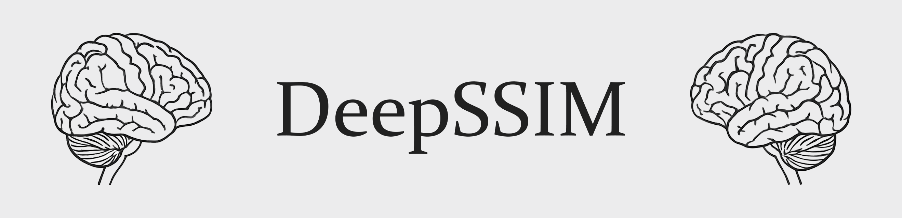
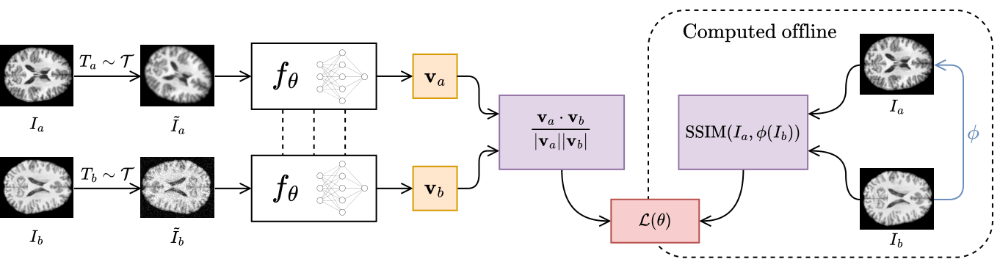

<p align="center">
    <strong>A Novel Metric for Detecting Memorization in Generative Models for Brain MRI Synthesis</strong><br/>
    <a href="https://scholar.google.com/citations?user=VNQ6auUAAAAJ">Antonio Scardace</a><sup>*</sup>,
    <a href="https://scholar.google.com/citations?user=Y2qMZYoAAAAJ">Lemuel Puglisi</a><sup>*</sup>,
    <a href="https://scholar.google.com/citations?user=DyGUX9IAAAAJ">Francesco Guarnera</a>,
    <a href="https://scholar.google.com/citations?user=OplbtHgAAAAJ">Sebastiano Battiato</a>, and
    <a href="https://scholar.google.com/citations?user=qh2Rr-cAAAAJ">Daniele Ravì</a><br/>
    <small>* <i>Joint first authors</i></small>
</p>

<div align="center">
    <a href="http://arxiv.org/abs/2509.16582"></a>
    <a href="https://github.com/brAIn-science/DeepSSIM/blob/main/LICENSE"></a>
    <a href="https://img.shields.io/badge/Python-3.12%2B-blue"></a>
</div>
<br/>

This repository contains the official code for our paper on DeepSSIM, a novel automated metric for detecting training data memorization in generative models applied to medical imaging. While generative models show great promise in generating synthetic medical data, they are vulnerable to memorizing sensitive information. DeepSSIM addresses this risk by detecting and quantifying memorized content.<br/>
We evaluate DeepSSIM in a case study involving synthetic Brain MRI data generated by a **Latent Diffusion Model (LDM)** trained under memorization-prone conditions, using **2,195 2D MRI scans** from two publicly available datasets - **IXI** and **CoRR**. Compared to state-of-the-art memorization metrics, DeepSSIM achieves superior performance, improving F1 score by an average of __+52.03%__ over the best existing method.

## Installation

We recommend using a dedicated virtual environment, such as [Anaconda](https://www.anaconda.com/), to avoid dependency conflicts. The code has been tested with Python 3.12, but it is expected to work with newer versions as well.<br/>
Clone the repository and install the package in editable mode:

```console
git clone https://github.com/brAIn-science/DeepSSIM.git
cd DeepSSIM/
pip install -e .
```

## Training DeepSSIM

<p align="center">
    
</p>

The DeepSSIM neural network can be trained using the command below. You can conveniently monitor the training progress using `Weights & Biases (WandB)`. If you prefer to skip this step, you can download our pre-trained model [here](https://huggingface.co/antonioscardace/deepssim) — we suggest placing it in the dedicated folder `/models/`.

```console
python scripts/deepssim_train.py \
  --dataset_images_dir PATH \
  --dataset_csv PATH \
  --exp_name STR \
  --use_gpu
```

## Usage

Since each model produces an embedding for each image rather than a direct similarity score between image pairs, the corresponding similarity matrix must first be computed. This can be done by running the following command. If you prefer to skip this step, you can download our pre-computed similarity matrices along with the corresponding index files, which are required to access matrix elements, [here](https://huggingface.co/datasets/antonioscardace/deepssim/tree/main).

```console
python scripts/compute_matrix.py \
  --dataset_images_dir PATH \
  --embeddings_dir PATH \
  --matrices_dir PATH \
  --indices_dir PATH \
  --model_path PATH \
  --metric_name {deepssim, chen, dar, semdedup} \
  --use_gpu \
  --augment
```

To evaluate a given metric, run the following command. This script computes the macro F1 score, as well as per-class precision and recall, based on the similarity matrix and index files previously computed.

```console
python scripts/eval.py \
  --synth_indices_path PATH \
  --real_indices_path PATH \
  --matrix_path PATH \
  --testset_csv PATH \
  --metric_name {deepssim, chen, dar, semdedup}
```

To generate the histogram visualizations reported in the paper, run the following command. This script requires a similarity matrix and the corresponding index files previously computed.

```console
python scripts/plot_reports.py \
  --synth_indices_path PATH \
  --real_indices_path PATH \
  --matrix_path PATH \
  --output_path PATH \
  --testset_csv PATH \
  --upper_threshold FLOAT \
  --low_threshold FLOAT \
  --exp_title STR
```

## Training the LDM

After downloading all required files from [here](https://huggingface.co/datasets/antonioscardace/deepssim/tree/main), you can retrain the Latent Diffusion Model (LDM) running the following commands. If you prefer to skip this step, you can download our datasets [here](https://huggingface.co/datasets/antonioscardace/deepssim/tree/main) — we suggest placing them in `/data_brain/` and `/data_chest/`, respectively.

First, train a Variational Autoencoder (VAE) to encode images into the latent space:

```console
python scripts/ldm_train_vae.py \
  --dataset_csv PATH \
  --output_dir PATH
```

Next, train the LDM using the VAE checkpoint:

```console
python scripts/ldm_train_diff.py \
  --dataset_csv PATH \
  --output_dir PATH \
  --aekl_ckpt PATH \
  --conditioning {none, variables, conditioning} \
  --duplication {none, low, high} \
  --latent_shape STR \
  --vae_space_shape STR
```

For the brain MRIs dataset, use `LATENT_SHAPE=3x36x28` and `VAE_LATENT_SHAPE=3x34x28`.<br/>
For the chest X-ray dataset, use `LATENT_SHAPE=VAE_LATENT_SHAPE=3x32x32`.<br/>
Finally, generate synthetic data using the trained models:

```console
python scripts/ldm_generate.py \
  --dataset_csv PATH \
  --aekl_ckpt PATH \
  --diff_ckpt PATH \
  --output_path PATH \
  --conditioning {none, variables, conditioning} \
  --latent_shape STR \
  --vae_space_shape STR \
  --n_gen_per_record INT
```

## Citation

Arxiv Preprint:

```bib
@article{scardace2025novel,
    title={A Novel Metric for Detecting Memorization in Generative Models for Brain MRI Synthesis},
    author={Scardace, Antonio and Puglisi, Lemuel and Guarnera, Francesco and Battiato, Sebastiano and Rav{\`\i}, Daniele},
    journal={arXiv preprint arXiv:2509.16582},
    year={2025}
}
```
