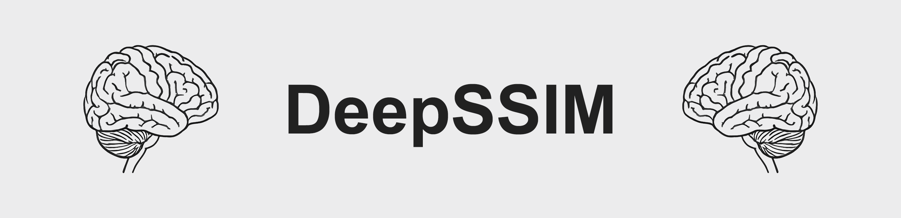
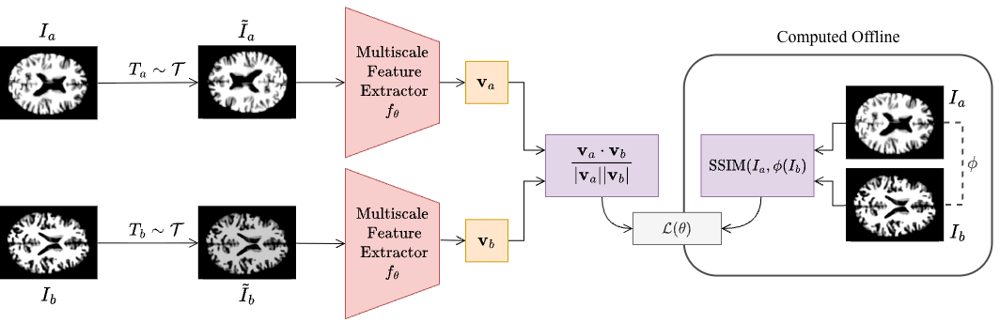

<p align="center">
    <small>Building on our WACV 2026 paper:<br/>
    <strong>A Novel Metric for Detecting Memorization in Generative Models for Brain MRI Synthesis</strong></small>
</p>
<hr>

<p align="center">
    <strong>Auditing Patient Privacy in Medical Generative Models:<br/>Scalable Memorization Detection with DeepSSIM++</strong><br/>
    <a href="https://scholar.google.com/citations?user=VNQ6auUAAAAJ">Antonio Scardace</a>,
    <a href="https://scholar.google.com/citations?user=DyGUX9IAAAAJ">Francesco Guarnera</a>,
    <a href="https://scholar.google.com/citations?user=OplbtHgAAAAJ">Sebastiano Battiato</a>, and
    <a href="https://scholar.google.com/citations?user=qh2Rr-cAAAAJ">Daniele Ravì</a>
</p>

<div align="center">
    <a href="https://img.shields.io/badge/Python-3.12%2B-blue?style=for-the-badge"></a>
    <a href="https://arxiv.org/abs/2609.03615"></a>
    <a href="https://ieeexplore.ieee.org/document/11492740"></a>
    <a href="https://huggingface.co/antonioscardace/deepssim/tree/main"></a>
    <a href="https://github.com/brAIn-science/DeepSSIM/blob/main/LICENSE"></a>
</div>
<br/>

Generative models for medical imaging can inadvertently memorize and reproduce sensitive, patient-specific anatomy, potentially compromising patient privacy. **DeepSSIM++** is a self-supervised metric designed to detect such leakage at scale. By learning multi-scale feature embeddings whose cosine similarity directly approximates SSIM, it eliminates the need for strict pixel-level registration and reduces the computational cost of millions of pairwise comparisons to just a few seconds.

## Installation

We recommend using a dedicated virtual environment, such as [Anaconda](https://www.anaconda.com/), to avoid dependency conflicts. The code has been tested with Python 3.12, but it is expected to work with newer versions as well.<br/>
Clone the repository and install the package in editable mode:

```console
git clone https://github.com/brAIn-science/DeepSSIM.git
cd DeepSSIM/
pip install -e .
```

## Training

<p align="center">
    
</p>

To apply DeepSSIM++ to your specific domain, train it on your own dataset using the command below, monitoring the training progress via `Weights & Biases (WandB)`. If you prefer to skip this step, you can download our pre-trained model [here](https://huggingface.co/antonioscardace/deepssim) — we recommend placing it in the dedicated folder `/models/`.

```console
python scripts/train.py \
  --dataset_images_dir data/images \
  --dataset_csv data/dataset.csv \
  --exp_name YOUR_EXP_NAME \
  --use_gpu
```

## Usage

To compute the similarity matrix between training and synthetic images, run the following command:

```console
python scripts/compute_matrix.py \
  --dataset_images_dir data/images \
  --embeddings_dir data/embeddings \
  --matrices_dir data/matrices \
  --indices_dir data/indices \
  --model_path models/deepssim.pt \
  --metric_name deepssim \
  --use_gpu
```

To evaluate the performance of a given metric, run the following command. This script computes the macro F1 score, TPR@5%FPR, Silhouette score, as well as per-class precision and recall, based on the previously computed similarity matrix and index files.

```console
python scripts/eval_classification.py \
  --synth_indices_path data/indices/synth.npz \
  --real_indices_path data/indices/real.npz \
  --matrix_path data/matrices/deepssim.npz \
  --testset_csv data/testset.csv \
  --metric_name deepssim
```

To generate a LayerCAM explainability map for a pair of images, run the following command:

```console
python scripts/explainability.py \
  --real_image_path data/images/real_image.png \
  --synth_image_path data/images/synth_image.png \
  --model_path models/deepssim.pt
```

To generate the histograms as those reported in the paper, run the following command. This script requires a similarity matrix and the corresponding index files to have been computed beforehand.

```console
python scripts/plot_reports.py \
  --synth_indices_path data/indices/synth.npz \
  --real_indices_path data/indices/real.npz \
  --matrix_path data/matrices/deepssim.npz \
  --output_path reports/deepssim.png \
  --testset_csv data/testset.csv \
  --low_threshold 0.76 \
  --upper_threshold 0.92 \
  --exp_title DeepSSIM++
```

## Citation

WACV 2026 Proceedings:

```bib
@inproceedings{scardace2026deep,
    title={A Novel Metric for Detecting Memorization in Generative Models for Brain MRI Synthesis},
    booktitle={2026 IEEE/CVF Winter Conference on Applications of Computer Vision (WACV)}, 
    author={Scardace, Antonio and Puglisi, Lemuel and Guarnera, Francesco and Battiato, Sebastiano and Ravì, Daniele},
    year={2026},
    pages={3868-3877},
    doi={10.1109/WACV61042.2026.00377}
}
```

Journal Extension Preprint:

```bib
@misc{scardace2026auditingpatientprivacymedical,
    title={Auditing Patient Privacy in Medical Generative Models: Scalable Memorization Detection with DeepSSIM++}, 
    author={Antonio Scardace and Francesco Guarnera and Sebastiano Battiato and Daniele Ravì},
    year={2026},
    eprint={2609.03615},
    archivePrefix={arXiv},
    url={https://arxiv.org/abs/2609.03615}
}
```